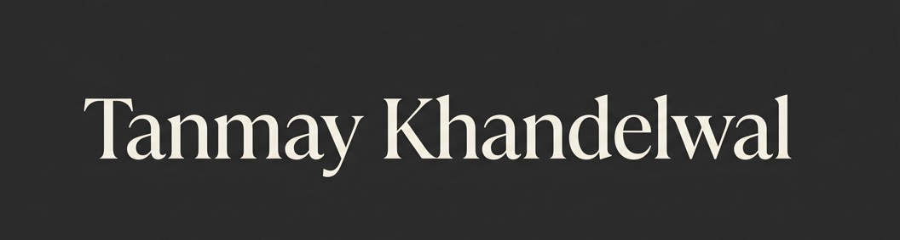

  

<h1 align="center">Hi, I'm Tanmay Khandelwal 👋</h1>

  <em>Backend-leaning Full Stack Developer · CS Undergrad @ LNMIIT Jaipur · Building things that actually work</em>

  

  
  
  

---

### 👨‍💻 About Me

I build systems that solve structured, real-world problems. My approach is simple: break down ambiguity into scalable architectures where correctness, performance, and usability matter.

* 🎯 **Focus:** Backend systems, Full-stack applications, Applied Machine Learning
* 💪 **Strength:** Translating complex problem statements into production-ready architectures
* 🔍 **Interests:** Distributed systems and production-grade engineering

 

**Timeline & Experience**
* 🎓 **B.Tech in Computer Science** @ LNMIIT Jaipur (CGPA: 8.27) · *Class of 2027*
* 💼 **Backend Developer Intern** @ Mentox Technologies · *Shipped 5 microservices & 40+ REST endpoints in production*
* 🤝 **WebDev Lead** @ ACM Chapter · *Built the official site & mentored juniors in React + backend integration*

---

### 🛠️ Tech Stack

**Languages** 

**Frameworks & Libraries** 

**Databases & Infrastructure** 

---

### 🚀 Featured Projects

| Project | Stack | Description |
|---|---|---|
| [**CampusChat**](https://github.com/RecurringNoob/CampusChat) | React, Node.js, WebRTC, MongoDB | University-verified real-time video chat with P2P matchmaking & JWT auth. |
| [**Predictive Maintenance**](https://github.com/RecurringNoob/Predictive-Maintenance) | FastAPI, scikit-learn, MQTT, Docker | End-to-end IoT pipeline with ML failure detection & SSE-streamed predictions. |
| [**FluxLink**](https://github.com/RecurringNoob/FluxLink) | Python, OpenCV, React, RAG, FAISS | Semantic PCB diffing tool with natural-language querying via LLM + vector store. |

---

### 🏆 Competitive Programming

*  Max rating: **1166**
*  **~350 problems** solved across Codeforces, LeetCode, CSES & GFG

---

### 📊 GitHub Stats

  
  

  

---

  <em>Open to internships, collabs, and interesting problems. Let's build something.</em>

